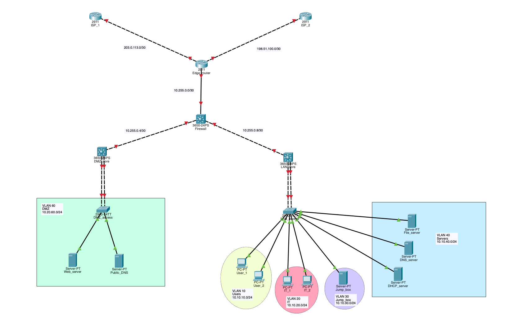
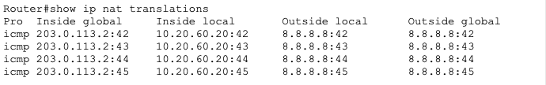

# Enterprise Network

## Network Topology 

### ISP_1
- Role: ISP provider 
- Routing: BGP neighbor with edge router 
- ASN: 65001
- Advertises: Default route 0.0.0.0/0

### ISP_2
- Role: ISP provider 
- Routing: BGP neighbor with edge router
- ASN: 65002
- Advertises: Default route 0.0.0.0/0

### Edge Router 
- Role: Internet edge device 
- Redundancy: Dual ISP upstream connectivity 
- Routing:
    - eBGP with ISP_1 and ISP_2
    - NOTE: loopback interfaces would be preferred for BGP peering to improve stability; however, Packet Tracer limitations required the use of directly connected interface IPs.

- Edge <--> Firewall
- Functions:
    - Route redistribution (BGP <--> OSPF)
    - Default route injection into OSPF for internet reachability to internal networks

- NAT/PAT
    - Configured PAT to translate internal private IP space to a sinlge public IP (LAN + DMZ)

### Firewall

- Role: Firewall / Area Border Router (ABR)
- Routing: OSPF (Area 0 <--> Area 1)
- Functions: 
    - Connects backbone (Area 0) to LAN (Area 1)
    - Performs inter-area route summarization
    - Provides internal traffic path to edge --> internet 
- OSPF Design:
    - Area 0 --> Edge router, DMZ
    - Area 1 --> LAN core
- Route Handling: 
    - Receives default route (0.0.0.0/0) from edge via OSPF
    - Advertises summarixed LAN route (10.10.0.0/16) into Area 0
    - Maintains specific LAN routes internally (10.10.x.x/24)
- OSPF external default route (E2) learned from the edge router, used to direct outbound traffic to the Internet

### LAN Core

- Role: Layer 3 Core Switch
- Routing: OSPF (Area 1)
- Functions:
    - Provides inter-VLAN routing for internal networks
    - Acts as the default gateway for end devices
    - Connects access layer switch to the routed network
- Layer 3 Services:
    - Inter-VLAN routing via SVIs
    - Default gateway assignments for each VLAN

- OSPF design:
    - Participates in Area 1 (LAN)
    - Advertises all VLAN subnets (10.10.x.0/24) to the firewall (ABR)
- Layer 2 Integration:
    - Etherchannel (LACP) uplink to access switch
    - Trunk configured with allowed VLANs for endpoint connectivity 
    - DTP disabled for security and consistency 

- Infrastructure Services:
    - DHCP for dynamic IP address assignment
    - DHCP relay configured on SVIs
    - DNS for internal name resolution (enterprise.com)

### DMZ Core

- Role: Layer 3 switch for DMZ segment
- Routing: Local VLAN gateway provided by DMZ core; inter-zone traffic controlled by firewall
- Functions:
    - Provides Layer 3 gateway services for DMZ hosts
    - Segments public-facing services from the internal LAN
    - Supports controlled access between LAN, DMZ, and external networks through the firewall
    - Enables name-based access to services via internal DNS (web.enterprise.com)
    - Hosts web and DNS services accessible internally and externally via NAT
- Layer 3 Services:
    - Subnet: 10.20.60.0/24
    - Inter-VLAN routing via SVI for VLAN 60
    - Default gateway assignment for DMZ hosts
- Service Deployment:
    - Web server (10.20.60.10) for HTTP services
    - DNS server (10.20.60.20) for internal name resolution
    - DNS A record configured (web.enterprise.com --> 10.20.60.10)
- Traffic Flow Design:
    - Internal: LAN Core --> Firewall --> DMZ Core
    - No direct layer 2 adjacency between LAN and DMZ
    - Centralized DNS hosted in DMZ for controlled name resolution
