# Enterprise Network
    
- The topology simulates a small enterprise network with segmented LAN and DMZ zones, providing secure internal access and controlled exposure of public-facing services

## Network Topology 

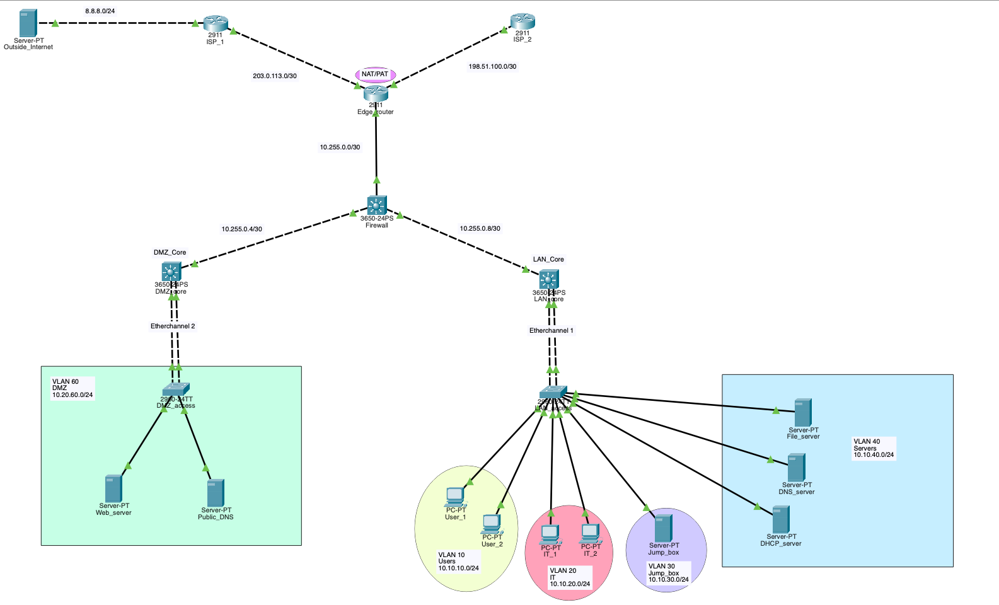

### Network Traffic Flow 

- External clients access public services via the internet using DNS resolution (web.enterprise.com → public IP)
- Incoming traffic reaches the edge router, where static PAT forwards requests to DMZ services (web and DNS servers)
- The firewall enforces security policies, controlling traffic between external, DMZ, and internal LAN zones
- DMZ hosts provide public-facing services while remaining isolated from the internal network
- Internal LAN users access external resources via dynamic PAT (NAT overload), sharing a single public IP
- Internal routing between VLANs is handled by the LAN core using SVIs
- Inter-zone traffic (LAN ↔ DMZ ↔ external) is inspected and permitted based on firewall ACLs
- Redundant Layer 2 connectivity is provided via EtherChannel between switches
- Network devices and servers are managed securely via SSH from the internal network

### Service Flow 

- A user on the internet requests web.enterprise.com
- DNS resolves the domain to the public IP of the edge router
- The edge router performs static PAT, forwarding the request to the internal web server in the DMZ
- The web server responds, and traffic is translated back to the public IP before returning to the client

## Devices

### ISP_1
- Role: ISP provider 
- Routing: BGP neighbor with edge router 
- ASN: 65001
- Advertises: Default route 0.0.0.0/0

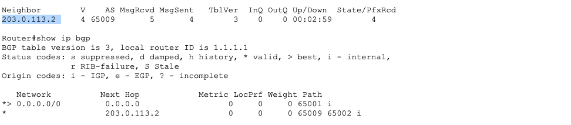

### ISP_2
- Role: ISP provider 
- Routing: BGP neighbor with edge router
- ASN: 65002
- Advertises: Default route 0.0.0.0/0

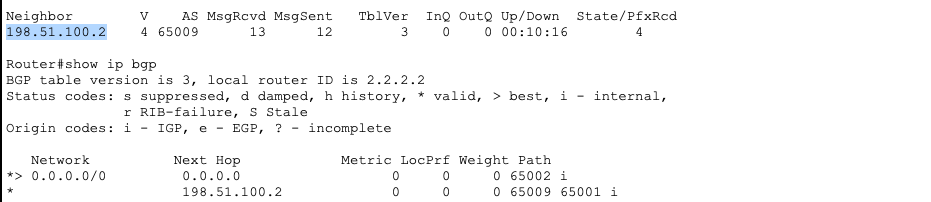

### Edge Router 
- Role: Internet edge device 
- Redundancy: Dual ISP upstream connectivity 
- Routing:
    - eBGP with ISP_1 and ISP_2
    - NOTE: loopback interfaces would be preferred for BGP peering to improve stability; however, Packet Tracer limitations required the use of directly connected interface IPs.

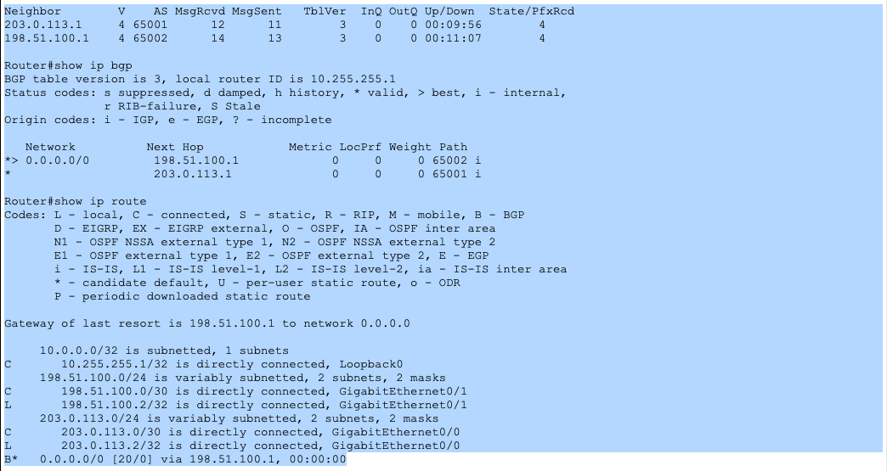

- Edge <--> Firewall
- Functions:
    - Route redistribution (BGP <--> OSPF)
    - Default route injection into OSPF for internet reachability to internal networks

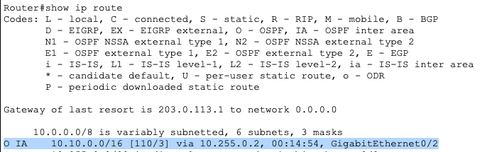

- NAT/PAT

    - Dynamic PAT (NAT overload) is used to allow internal LAN hosts to share a single public IP for outbound internet access
    - Static PAT (port forwarding) is used to expose internal DMZ services to the internet via a shared public IP

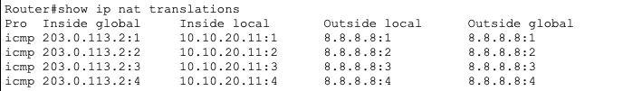

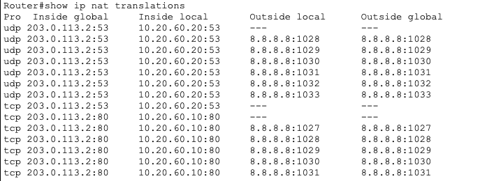

### Firewall

- Role: Firewall / Area Border Router (ABR)
- Routing: OSPF (Area 0 <--> Area 1)
- Functions: 
    - Connects backbone (Area 0) to LAN (Area 1)
    - Performs inter-area route summarization
    - Provides internal traffic path to edge --> internet 
- OSPF Design:
    - Area 0 --> Edge router, DMZ
    - Area 1 --> LAN core
- Route Handling: 
    - Receives default route (0.0.0.0/0) from edge via OSPF
    - Advertises summarixed LAN route (10.10.0.0/16) into Area 0
    - Maintains specific LAN routes internally (10.10.x.x/24)
- OSPF external default route (E2) learned from the edge router, used to direct outbound traffic to the Internet

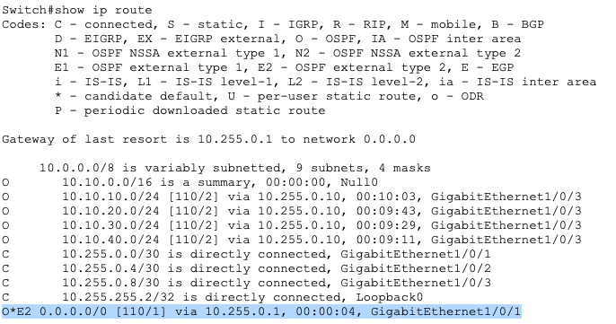

### LAN Core

- Role: Layer 3 Core Switch
- Routing: OSPF (Area 1)
- Functions:
    - Provides inter-VLAN routing for internal networks
    - Acts as the default gateway for end devices
    - Connects access layer switch to the routed network
- Layer 3 Services:
    - Inter-VLAN routing via SVIs
    - Default gateway assignments for each VLAN

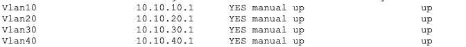

- OSPF design:
    - Participates in Area 1 (LAN)
    - Advertises all VLAN subnets (10.10.x.0/24) to the firewall (ABR)
- Layer 2 Integration:
    - Etherchannel (LACP) uplink to access switch
    - Trunk configured with allowed VLANs for endpoint connectivity 
    - DTP disabled for security and consistency 

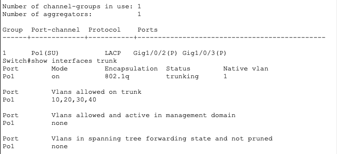

- Infrastructure Services:
    - DHCP for dynamic IP address assignment
    - DHCP relay configured on SVIs
    - DNS for internal name resolution (enterprise.com)

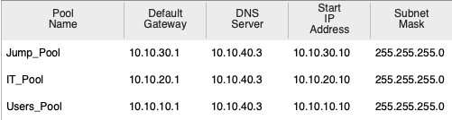

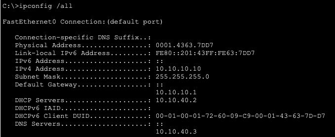

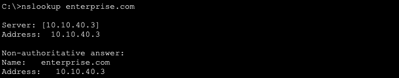

### LAN Security

#### Access control, STP protection, and Layer 2 attack mitigation

- Management Access for LAN (without jump box available on pt):
    - Configured segmented management access using VLANs, ACLs, and SSH
    - Restricted administrative access to IT VLAN only (10.10.20.0/24)
    - Configured dedicated management VLAN (Jump_Box VLAN – 10.10.30.0/24) 
    - Applied extended ACL to permit SSH to management interface (10.10.30.1)
    - Enforced device access control using VTY line restrictions
    - Validated policy with successful IT_VLAN access and denied Users_VLAN access

        - ACL Configuration 
        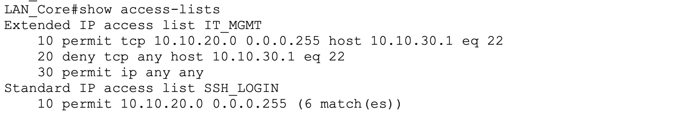

        - SSH Success (IT VLAN)
        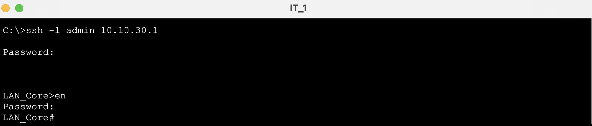

        - SSH Denial (User VLAN)
        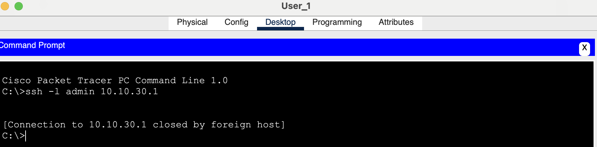

- Native VLAN Blackhole (VLAN 999):
    - Prevents VLAN hopping and double tagging
    - Configure all trunk links and unused ports to the native VLAN

    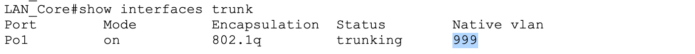

- Port Security:
    - Stops unauthorized devices on access ports 
    - Configure it on both used and unused ports 

    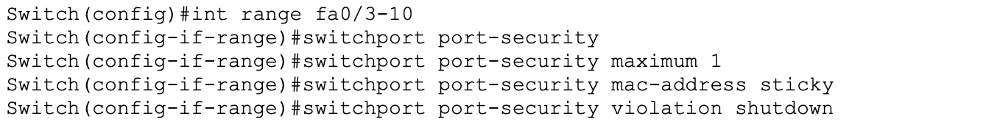

- Root Guard:
    - Prevents another switch from becoming root (STP)
    - Configured "Root Primary" which establishes the switch as the STP root for selected VLANs
    - Utilized PVST (Per-VLAN Spanning Tree) to enable independent Layer 2 topology control and root bridge selection per VLAN

    
    
    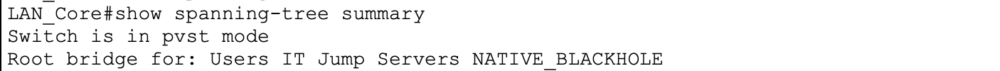

- BPDU Guard/PortFast:
    - Stop endpoints from sending BPDUs (from rogue switches)
    - Configured only on access ports
    - PortFast --> skips STP learning/listening for faster host connectivity

    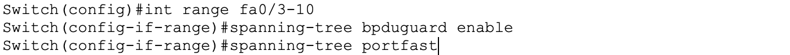

- Storm Control:
    - Mitigates broadcasts storms preventing Layer 2 flooding and potential DDoS conditions
    - NOTE: The storm-control command in packet tracer is the only option

    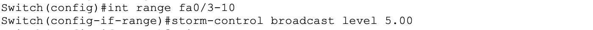
    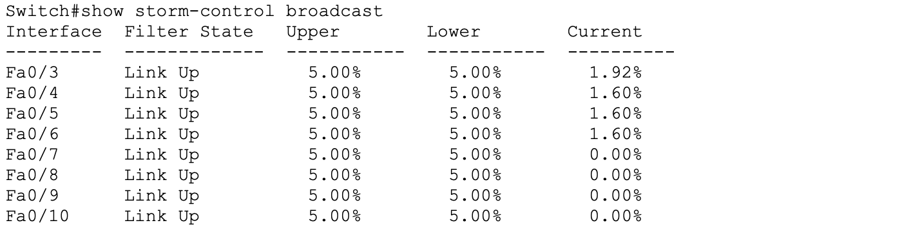

- DHCP Snooping & ARP Inspection:
    - Snooping: Blocks fake DHCP servers and builds trusted IP–MAC bindings preventing MitM attacks
    - DAI: Uses DHCP Snooping bindings to stop ARP spoofing
    
    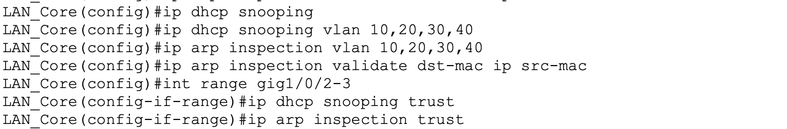
    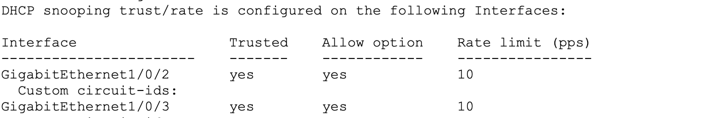
    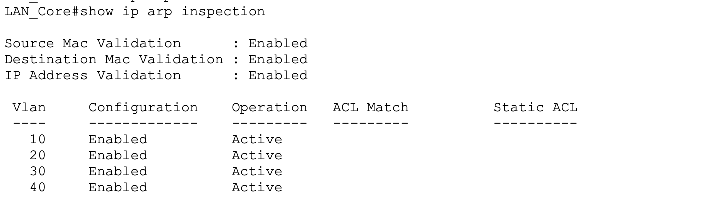

## DMZ

### DMZ Core

- Role: Layer 3 switch for DMZ segment
- Routing: Local VLAN gateway provided by DMZ core; inter-zone traffic controlled by firewall
- Functions:
    - Provides Layer 3 gateway services for DMZ hosts
    - Segments public-facing services from the internal LAN
    - Supports controlled access between LAN, DMZ, and external networks through the firewall
    - Enables name-based access to public services via DNS hosted in the DMZ
    - Supports public service exposure through NAT on the edge router

### DMZ Services

- Service Deployment:
    - Web server (10.20.60.10) providing HTTP services
    - DNS server (10.20.60.20) providing public name resolution
    - DNS A record:
        web.enterprise.com --> 203.0.113.2 (public IP via NAT)

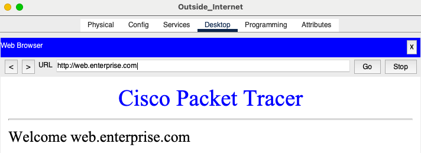

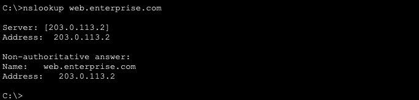

